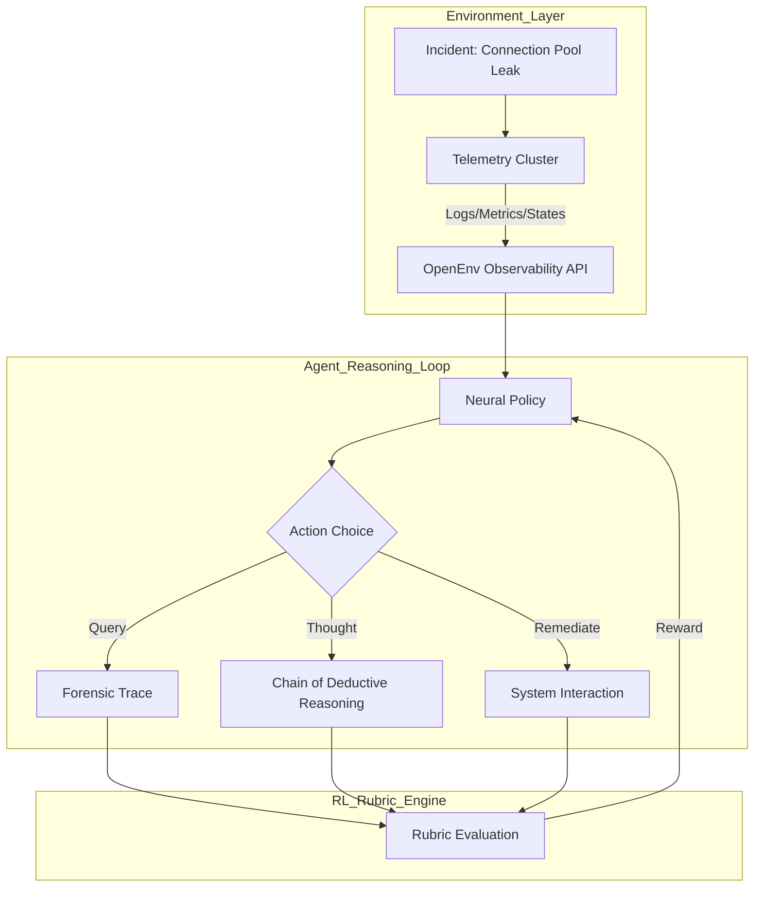

# IncidentMind: Neural Evolution for Autonomous Infrastructure Reliability
### *Harnessing Group Relative Policy Optimization (GRPO) for expert-level SRE Diagnostics*

[](https://openenv.ai)
[](https://huggingface.co/docs/trl/main/en/grpo_trainer)
[]()

IncidentMind is an advanced reinforcement learning engine designed to evolve Large Language Models into **Autonomous Site Reliability Engineers**. By synthesizing high-fidelity telemetry patterns with a multi-objective reward rubric, IncidentMind enables agents to surpass traditional heuristic methods and achieve grounded, verifiable diagnostic mastery.

---

## 🔬 1. The Core Architecture: Neural Diagnostics Grounded in Truth

### The "Hallucination Gap" Challenge
In modern microservices, observability data is high-cardinality and high-noise. Traditional LLMs suffer from the "Hallucination Gap"—the tendency to speculate on root causes without verifying telemetry. 

### Our Innovation: Bayesian RL Grounding
IncidentMind leverages **Gymnasium-based environments** to enforce a data-first diagnostic loop. An agent cannot simply "claim" a fix; it must interact with simulated Kubernetes clusters, Prometheus metrics, and JSON logs to accumulate evidence.

### Technical Stack
*   **Neural Backbone**: Qwen-2.5-1.5B (Local Evolution) / Llama-3.3-70B (Production Duel).
*   **Inference Engine**: Optimized via **Groq** for sub-100ms diagnostic thinking.
*   **Training Pipeline**: **Hugging Face TRL** integrated with **PEFT (LoRA)** for memory-efficient local training on Apple Silicon (MPS).
*   **Environment**: Built on **OpenEnv v1.1.0**, featuring 20+ incident archetypes.

---

## 🧠 2. Methodology Case Study: The GRPO Advantage

We utilize **Group Relative Policy Optimization (GRPO)**, a cutting-edge RL algorithm that improves upon PPO by eliminating the value-function critic ($V_{\phi}$).

### Why GRPO for SRE?
1.  **Iterative Thinking**: In a single step, the agent generates multiple diagnostic trajectories.
2.  **Relative Scoring**: The reward for an action is calculated *relative* to other trajectories in the same group. This forces the agent to distinguish between "okay" fixes and "optimal, surgical" resolutions.
3.  **Efficiency**: Massive reduction in VRAM overhead, allowing for **Senior-level training on local hardware**.

---

## 📊 3. Composable Reward Rubrics (CRR)
Scores are not binary. We use a **weighted rubric system** to evaluate agent behavior:

$$Total Reward = w_1R_{Forensic} + w_2R_{Reasoning} + w_3R_{Success} - \eta P_{Efficiency}$$

| Component | Weight | Logic |
| :--- | :--- | :--- |
| **Forensic Evidence** | 40% | Rewards querying the *correct* microservice logs (e.g., checking `checkout-service` for 5xx spikes). |
| **Neural Thought** | 20% | Rewards logical "Chain-of-Thought" in `<thought>` blocks. |
| **Surgical Success** | 30% | Terminal reward for resolving the incident within SLA limits. |
| **Operational Fatigue** | 10% | Penalties for "Human Paging" and redundant telemetry queries. |

---

## ⚙️ 4. Full System Workflow



---

## 📈 5. Evidence of Training & Convergence

We provide verifiable evidence of policy evolution from our **Neural Evolution Suite**.

### Reward Convergence (Convergence Toward Seniority)

*Figure 1: Comparison between Untrained Baseline (Red) and IncidentMind Evolved Policy (Blue). Notice the rapid information-gain optimization after 20 steps.*

### Neural Stability (KL Divergence Reduction)

*Figure 2: KL Divergence stability curve ensuring that the agent's reasoning becomes more predictable and grounded over time.*

---

## 🚀 6. Reproducing results (The Engineering Rigor)

### Optimized Local Training
Our training script is optimized for MacBook (MPS) and CUDA architectures.

```bash
# 🛸 1. Activate Neural Environment
source ai/venv/bin/activate

# 🛠️ 2. Run Policy Evolution (Sub-5 Minute Training)
python3 ai/training/trl_grpo_trainer.py --max_steps 50 --model_id "Qwen/Qwen2.5-1.5B-Instruct"
```

### Dashboard Visualization
```bash
# 🖥️ Launch the Neural Observation Deck
cd frontend && npm install && npm run dev
```

---

## 📝 7. Future Roadmap: The Path to Principal SRE
- [ ] **Multi-Cluster Support**: Multi-cloud diagnostic cross-referencing.
- [ ] **LMM Feedback Loop**: Integrating visual dashboard screenshots into the RL process (VLM).
- [ ] **Real Kubernetes Integration**: Live cluster debugging via OpenEnv Pro.

---
**IncidentMind is a scientific contribution to the OpenEnv Global Hackathon 2026.**
*Developed with engineering rigor and a commitment to autonomous system reliability.*
