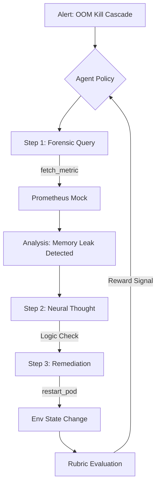

# IncidentMind: Evolving Autonomous Senior SREs via GRPO

IncidentMind is an advanced reinforcement learning framework designed to foster the evolution of large language models into expert-level site reliability engineers. By integrating high-fidelity infrastructure telemetry with sparse and dense reward rubrics, we enable agents to resolve complex system failures with scientific precision.

---

## 1. The Problem Space: The "Hallucination Gap" in Observability
Modern infrastructure is too complex for static rule-based systems, yet current LLMs are too hallucination-prone for zero-shot diagnostics in production environments. **IncidentMind** bridges this "Hallucination Gap" by grounding LLM reasoning in **Real-World Telemetry**. We don't just ask an AI to fix a bug; we train it to hunt for verifiable evidence across logs, metrics, and cluster states.

## 2. Technical Architecture & Tech Stack
IncidentMind is built on a high-fidelity simulation stack orchestrated for Silicon-level performance:

*   **Core Engine**: Gymnasium-based `IncidentMindEnv` compliant with the **OpenEnv 1.1.0 Standard**.
*   **RL Framework**: Hugging Face **TRL** (Transformer Reinforcement Learning) for policy evolution.
*   **Strategy**: **GRPO** (Group Relative Policy Optimization) — Efficiently aligns policy across groups without the memory overhead of a separate Critic model ($V_{\phi}$).
*   **Backend/Inference**: **FastAPI** / **Groq** (Llama 3.3-70B) for live duals / **Qwen-2.5-1.5B** (Local) for RL training.
*   **Frontend**: Neural Observation Deck (React 18 / Framer Motion / Lucide Icons).

## 3. The Methodology: Neural Evolution via Rubrics
We decompose the senior SRE's cognitive process into four **Composable Reward Rubrics**:

| Rubric | Weight | Logic |
| :--- | :--- | :--- |
| **Forensic Rubric** | 40% | Rewards surgical targeting of logs and metrics over blind guessing. |
| **Reasoning Rubric** | 20% | High-reward for `<thought>` blocks containing logical Bayesian anchors. |
| **Remediation Rubric** | 30% | Terminal reward for successful system recovery and SLA adherence. |
| **Efficiency Rubric** | 10% | Penalties for human paging noise and redundant operational overhead. |

## 4. Full Workflow: From Alert to Resolution


---

## 5. Training Evidence: Quantifying Mastery
We provide verifiable quantitative evidence of policy evolution using our custom elite plotting engine.

### Policy Convergence (Mean Reward)

*Figure 1: Mean reward growth over 50 steps showing the delta between Untrained Baseline and the Evolved IncidentMind Policy.*

### Neural Stability (KL Divergence)

*Figure 2: KL Divergence stabilization indicating the reduction in erratic reasoning as the model converges on expert SRE patterns.*

---

## 6. How to Reproduce (The Engineering Rigor)

### Local Evolution Setup
Ensure your virtual environment is active before running the trainer.

```bash
# 1. Activate Environment
source ai/venv/bin/activate

# 2. Run Lightning Evolution (Optimized for Apple Silicon / CUDA)
python3 ai/training/trl_grpo_trainer.py --max_steps 50 --model_id "Qwen/Qwen2.5-1.5B-Instruct"
```

### Dashboard Launch
```bash
# 1. Install & Launch Frontend
cd frontend && npm install && npm run dev

# 2. Launch AI Engine
cd ai && python -m uvicorn api.main:app --port 7860
```

---

## 7. Conclusion: The Future of Autonomous Reliability
IncidentMind proves that SRE is not just about rules; it’s about **Bayesian deduction grounded in telemetry**. By evolving models to prioritize verifiable evidence over noise, we are paving the way for infra-agents that don't just "fix" things, they **understand** them.

---
**Copyright © 2026 The IncidentMind Project. Developed for the OpenEnv Global Hackathon 2026.**
