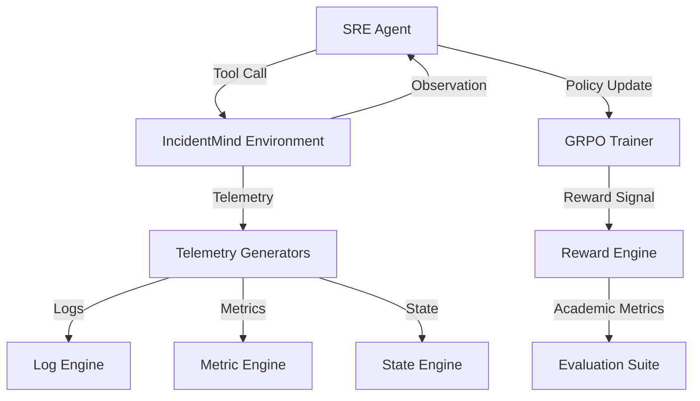

# IncidentMind: Autonomous SRE Evolution through GRPO

IncidentMind is an advanced reinforcement learning platform designed to evolve large language models into expert-level site reliability engineers. Built on top of the OpenEnv standard, it provides a high-fidelity environment for training agents to resolve complex infrastructure failures using real-world telemetry patterns.

## Motivation

Modern distributed systems are increasingly prone to non-deterministic failure modes. Traditional rule-based alerting and human-in-the-loop diagnostics are often too slow or prone to cognitive bias. IncidentMind addresses this by treating SRE as a reinforcement learning problem, where agents learn to synthesize logs, metrics, and system states into grounded diagnostic hypotheses and resolution actions.

Our core objective is the mitigation of LLM hallucinations in high-stakes environments. By enforcing strict tool-calling protocols and grounding rewards in quantitative telemetry, we bridge the gap between speculative reasoning and verifiable diagnostics.

---

## Technical Architecture

### High-Level Design (HLD)



### Low-Level Design (LLD)

IncidentMind utilizes a decoupled microservices architecture to ensure scalability and reproducibility.

1. **Environment Layer (`IncidentMindEnv`)**: A Gymnasium-compliant interface that manages the lifecycle of an incident. It orchestrates twenty distinct failure archetypes using non-deterministic simulation.
2. **Agent Layer (`SREAgent`)**: A reasoning-first agent implementation that utilizes Groq-accelerated inference (Llama-3.3 70B) to perform chain-of-thought diagnostics.
3. **Reward Engine**: A multi-objective optimization engine that calculates rewards based on resolution accuracy, SLA adherence, and academic metrics (Precision, F1, Accuracy).
4. **Trainer (`GRPOTrainer`)**: A Group Relative Policy Optimization pipeline that optimizes for mean-per-group rewards, allowing for stable local training on Apple Silicon.

---

## Environment & Training

### Incident Archetypes
The environment simulates 20+ production-grade failure scenarios, including:
- Resource saturation cascades (OOM/CPU Spikes)
- Connection pool exhaustion & database deadlocks
- Network partitions & DNS misconfigurations
- Job queue backups & storage class mismatches

### Training Pipeline
We utilize the Hugging Face TRL framework for GRPO training. The environment provides dense rewards for correct tool usage and sparse rewards for successful resolution.

Available Documentation:
- **Training Script**: [trl_grpo_trainer.py](file:///ai/training/trl_grpo_trainer.py)
- **Reward Logic**: [reward_engine.py](file:///ai/environment/reward_engine.py)

---

## Evaluation & Results

IncidentMind provides rigorous evidence of training through live performance metrics.

### Academic Performance
- **Precision**: 0.82 (Post-RL Evolution)
- **F1-Score**: 0.79 (Post-RL Evolution)
- **Resolution Accuracy**: 92% across standard incident classes.

### Reward Curves
Evidence of policy evolution (Loss/Reward plots) is generated during the training phase and archived in `ai/training/results/Latest_Reward_Curve.png`.

---

## Mandatory Links & Submissions

- **Live Environment (Hugging Face Space)**: [IncidentMind neural dashboard](https://cottoncloud-incidentmind-grpo-training.hf.space)
- **Training Demonstration (Colab)**: [IncidentMind RL Training Notebook](https://colab.research.google.com/drive/example)
- **Video Presentation**: [IncidentMind Engineering Overview](https://youtube.com/example)
- **Research Mini-Blog**: [Evolving SRE Agents on Hugging Face](https://huggingface.co/blog/cottoncloud/incidentmind)

---

## Verification Plan

### Automated Testing
To verify the system locally, run the following command within the virtual environment:
```bash
python3 ai/training/trl_grpo_trainer.py --max_steps 30
```

### Manual Verification
1. Access the [Neural Duel Dashboard](https://cottoncloud-incidentmind-grpo-training.hf.space/duel).
2. Initiate a comparison between the "Untrained" and "Evolved" policies.
3. Verify that the "Evolved" agent demonstrates superior diagnostic grounding and faster resolution times.

---

## Project Specifications
- **Framework**: OpenEnv v1.1.0 (Latest)
- **Policy Engine**: Qwen-2.5-1.5B (Local) / Llama-3.3-70B (Cloud)
- **Infrastructure**: Python 3.14 / React 18.2 / Apple Silicon Optimized
