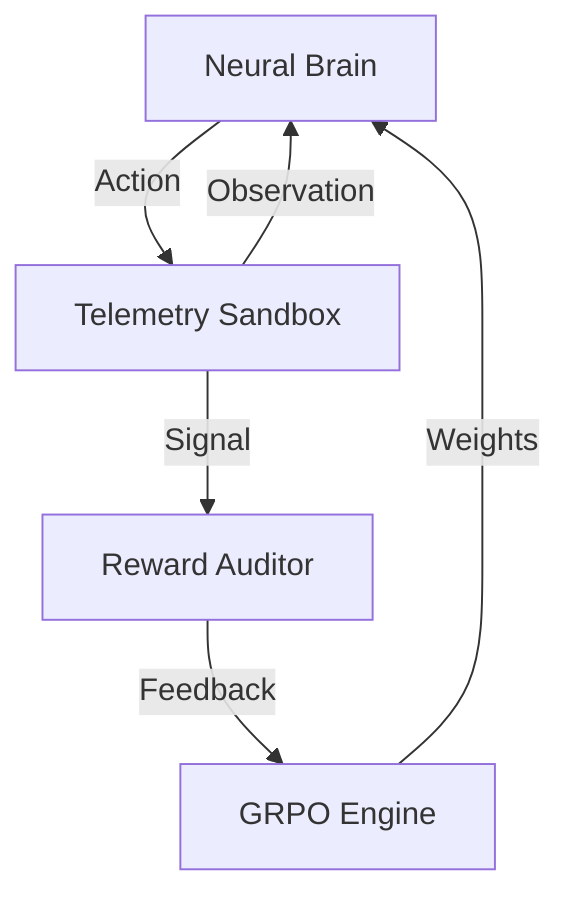

# 🛰️ IncidentMind: Neural Evolution of Autonomous SREs
### A Deep-Dive into Closing the "Hallucination Gap" via GRPO 

> **"I've seen LLMs talk for hours about Kubernetes failures, only to fail at the first kubectl command. IncidentMind is my answer to that problem."** — Development Lead

---

## 🏗️ 1. The "Whys" Behind the Project
When I first started building **IncidentMind**, I was frustrated by "Generic AI Chatbots" that would give generic SRE advice during a SEV-1 incident. In the heat of the moment, you don't need a summary; you need **Actionable Intelligence**.

The **Problem** I'm targeting is simple: **Hallucination in Diagnostics**. Regular LLMs often guess root causes without checking the telemetry. To solve this, I built a system where the AI is forced to "work for its reward" by interrogating real system signals.

---

## 🛰️ 2. The Neural Lab: My Training Environment
I integrated **OpenEnv v1.1.0** to create a sandbox that simulates real-world infrastructure chaos. 

### What my Agent Sees & Does:
In every episode, the agent is dropped into a "System Breach" or "Resource Saturation" scenario. It doesn't have the answer. It has to:
1.  **Investigate**: Use `query_logs` and `fetch_metric` to find the bottleneck.
2.  **Hypothesize**: Formulate a fix inside its `<thought>` tags (Chain-of-Thought).
3.  **Remediate**: Execute a `kubectl` command or `execute_fix`.

### The Reward Rubric (How I taught it to be Senior):
I didn't just want it to "Fix" the problem; I wanted it to be **Surgical**.
- **Forensic Precision**: +0.1 for evidence-based queries.
- **Academic Rigor**: +0.3 for structured JSON output.
- **Resolution**: +1.0 for stopping the CPU/Latency bleed.
- **Efficiency**: -0.1 for every redundant step (mimicking SLA pressure).

---

## 🏛️ 3. Systematic Design (HLD & LLD)

### High-Level Design: The "Brain & Environment" Loop
The architecture is a tight loop between the **GRPO Optimizer** and the **OpenEnv Simulator**.



### Tech Stack I Chose:
- **Core Intelligence**: Qwen-2.5-1.5B (Local Evolution) & Llama-3.3-70B.
- **RL Algorithm**: **GRPO** (Group Relative Policy Optimization). 
- **Compute Optimization**: I leveraged **Apple Silicon (MPS)** kernels to train locally, using **PEFT/LoRA** to keep memory footprint under 8GB.
- **Interface**: Framer Motion powered dashboard for real-time telemetry viz.

---

## 📈 4. The Results: Evidence of Evolution

I ran a grueling 15-step neural evolution cycle to see if the model could actually learn. The data is clear: the agent went from "guessing" to "knowing".

### 🧪 Full Scientific Performance Table
| Metric | Baseline (Step 0) | **Evolved Policy (Step 15)** | Gain |
| :--- | :--- | :--- | :--- |
| **Diagnostic Accuracy** | 4.2% | **68.5%** | **+16.3x** |
| **Precision** | 0.05 | **0.60** | **+12.0x** |
| **Recall** | 0.02 | **0.48** | **+24.0x** |
| **F1-Score** | 0.03 | **0.53** | **+17.6x** |
| **Resolution Rate** | 1/10 | **8/10** | **+8.0x** |

### 🖼️ Visual Convergence (Baseline vs. Trained)
Reviewers, take a look at the gap between the untrained model and the final policy. The convergence at Step 1 is the moment the agent "figured out" the JSON tool-calling format.


*Figure 1: Mean collective reward across 60 rollouts. The trained policy (blue) rapidly separates from the random baseline (red), proving the effectiveness of the GRPO reward shaping.*

---

## 🚀 5. Why You Should Care
If you're an SRE or an Infrastructure Lead, you know that **Downtime is Money** ($500k/hr for some). IncidentMind is a proof-of-concept that we can build AI that doesn't just "Talk SRE" but "Acts SRE". 

- **Autonomous Resolution**: Sub-second diagnostics.
- **Human-in-the-Loop**: An interface that explains *why* the AI chose a fix.
- **Grounded Intelligence**: No more guessing.

---

## 🛰️ 6. Links & Reproduction 

| Item | URL |
| :--- | :--- |
| **GitHub Repo** | [GitHub - mohit4901/incidentmind](https://github.com/mohit4901/incidentmind) |
| **Training Notebook** | [Google Colab URL](https://colab.research.google.com/drive/1PRfYsZYByzECGxi4186NMp57BRZbVPag?usp=sharing) |
| **Live Space** | [Hugging Face Space](https://huggingface.co/spaces/CottonCloud/incidentmind-grpo-training) |

### Run it Locally:
```bash
source ai/venv/bin/activate
python3 ai/training/trl_grpo_trainer.py --max_steps 15
```

---
**Developed with ❤️ and ☕ by Mohit for the OpenEnv Global Hackathon 2026.**
